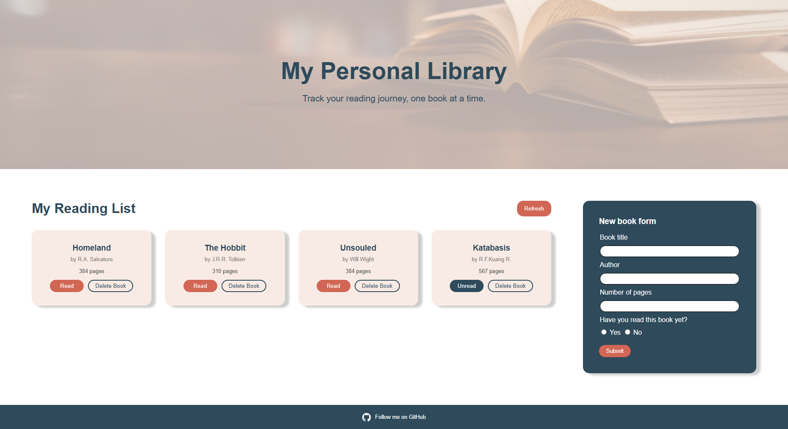

# 📚 Odin Library

A simple JavaScript Library app built as part of [The Odin Project](https://www.theodinproject.com/lessons/node-path-javascript-library) curriculum. This project demonstrates core JavaScript concepts including object constructors, DOM manipulation, and event handling—all wrapped in a clean, interactive UI.

## 📷 View Demo

[](https://wolfskullcave.github.io/odin-library/)

[open in browser](https://wolfskullcave.github.io/odin-library/)


## 🚀 Features

- **Add New Books**  
  Use a form to input book details and add them to your personal library.

- **Display Books**  
  Books are rendered dynamically as cards on the page using DOM manipulation.

- **Remove Books**  
  Each book card includes a delete button to remove it from the library.

- **Toggle Read Status**  
  Easily switch a book’s read status between “Read” and “Unread.”

## 🧠 Tech Stack

- HTML5  
- CSS3  
- JavaScript (ES6+)

## 🛠️ How It Works

- Books are created using a constructor function and stored in an array (`myLibrary`).
- Each book is assigned a unique ID using `crypto.randomUUID()` for easy tracking.
- DOM elements are linked to book objects via `data-attributes`.
- Form submission is handled with `event.preventDefault()` to avoid page reloads.
- Read status toggling is implemented via a prototype method on the `Book` object.

## 📦 Getting Started

1. Clone the repo:
   ```bash
   git clone https://github.com/wolfSkullCave/odin-library.git
   ```
2. Open `index.html` in your browser.
3. Start adding books to your library!

## 🎯 Goals

This project emphasizes:
- Separation of concerns between data logic and UI logic.
- Clean, readable code with modular functions.
- Hands-on practice with JavaScript fundamentals.

## 🙌 Acknowledgments

Built with guidance from [The Odin Project](https://www.theodinproject.com/paths/full-stack-javascript/courses/javascript) — an open-source curriculum for aspiring web developers.

---

